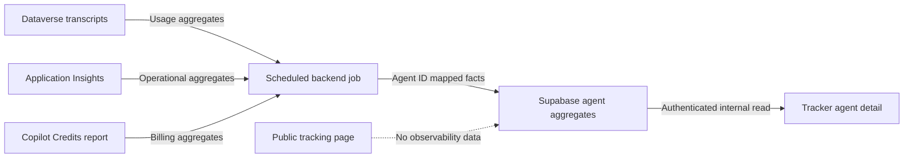

# Agent observability discovery

**Jira:** [AIBU-77 — Agent Usage Tracking](https://digitalrealty-cdo.atlassian.net/browse/AIBU-77)  
**Future UI:** [AIBU-80 — Agent Observability Dashboard](https://digitalrealty-cdo.atlassian.net/browse/AIBU-80)  
**Status:** Discovery contract — no integration or UI has been built  
**Prepared:** September 16, 2026

## Purpose and boundary

This document defines how to prove the data needed for agent observability before adding it to the tracker. It is based on Microsoft documentation, the existing tracker, the AIBU-77 and AIBU-80 stories, and the September meeting notes.

No Digital Realty tenant data was accessed while preparing it. Every statement below is marked as either:

- **Documented:** supported by Microsoft documentation or by the current repository.
- **Tenant validation required:** dependent on Digital Realty's environments, permissions, policies, or actual data.
- **Metric definition required:** dependent on a business decision from Mark, Nabih, Brian, or the relevant business owner.

This phase does not:

- add database tables, migrations, routes, charts, or placeholder observability values;
- enable Application Insights or change transcript retention;
- request, store, or expose connection strings, client secrets, tokens, tenant IDs, or transcript content;
- expose observability on the public `/track/:token` page;
- assume that a tracker title is the same as a Copilot Studio agent identity.

## Recommendation

Use three sources with distinct responsibilities:

1. **Dataverse `ConversationTranscript`** is the proposed source of record for adoption, sessions, outcomes, and feedback.
2. **Power Platform Copilot Credits** is the proposed source of record for billing and credit consumption.
3. **Application Insights** is the proposed source of record for operational latency, exceptions, and tool/runtime failures. It supplements Dataverse; it does not replace usage or billing data.

Prove Dataverse and Copilot Credits against one published Teams agent before designing AIBU-80. Inspect Application Insights during the proof only if it is already connected. Enabling it is a separate change because its optional settings can capture user identity, message text, tool inputs, and tool outputs.

The future tracker should read agent-scoped aggregates from Supabase. It must not query Microsoft services from the browser or receive raw transcripts.

## Source boundaries

| Question | Proposed source | Why | Status |
| --- | --- | --- | --- |
| How many distinct people used the agent? | Dataverse | Transcript activities can contain a hashed user identifier. | Documented; stability in Teams must be tenant-validated. |
| How many sessions occurred? | Dataverse | A transcript represents a conversation/session after it becomes idle. | Documented; final session definition is required. |
| When was the agent used? | Dataverse | Conversation and record timestamps support weekly and monthly windows. | Documented. |
| Was usage from Teams? | Dataverse | Transcript content includes a channel identifier; Teams is represented as `msteams`. | Documented. |
| Did the conversation succeed? | Dataverse | Session information can report outcomes such as resolved, escalated, or abandoned. | Documented; approved success formula is required. |
| Did the agent or a tool fail operationally? | Application Insights | Agent-level events and environment-level spans are intended for runtime diagnostics. | Documented; available schema and scope must be tenant-validated. |
| How long did it take? | Application Insights | It is the primary operational telemetry source for durations and dependencies. | Documented; metric definition is required. |
| What feedback did users provide? | Dataverse | Transcript activities can contain supported CSAT, PRR, or feedback events. | Documented; enabled feedback mechanisms must be tenant-validated. |
| How many Copilot Credits were used? | Power Platform admin center / licensing reporting | Credits are not stored in `ConversationTranscript`. | Documented. |
| What did the agent cost in currency? | Finance-approved conversion of Copilot Credits | Credit consumption is not automatically the same as a currency amount. | Metric definition and finance validation required. |
| How much money did the agent save? | Existing tracker savings fields | Savings is a business estimate already captured by the tracker, not a telemetry value. | Documented in the repository. |

### Why Cosmos is not the default

The meeting notes mention Cosmos as a previous storage location. No Cosmos integration, schema, connection, or design exists in this repository. Adding Cosmos would introduce another secured data service and synchronization path without solving access to the source systems.

For this tracker, the proposed path is to write small, agent-scoped aggregates into its existing Supabase database. Reconsider Cosmos only if an existing enterprise observability pipeline already publishes an approved aggregate contract there. That is a tenant-validation question, not an assumption.

## Candidate metric dictionary

These candidates are intentionally not treated as final requirements. AIBU-80 says performance metrics remain on hold until they are defined with business leaders.

| Candidate | Proposed calculation | Window | Source | Privacy | Readiness |
| --- | --- | --- | --- | --- | --- |
| Weekly active users | Count distinct stable hashed user IDs with at least one non-design-mode session. | Rolling 7 days or calendar week — choose one. | Dataverse | Pseudonymous identifier | Metric definition required |
| Monthly active users | Count distinct stable hashed user IDs with at least one non-design-mode session. | Rolling 30 days or calendar month — choose one. | Dataverse | Pseudonymous identifier | Metric definition required |
| Sessions | Count reconstructed conversations after merging split transcript rows. | Week and month | Dataverse | Aggregate only | Definition and split-row validation required |
| Usage trend | Current period sessions or active users compared with the immediately preceding equal period. | Week-over-week and month-over-month | Dataverse | Aggregate only | Metric definition required |
| Outcome rate | Sessions with an approved successful outcome divided by eligible completed sessions. | Week and month | Dataverse | Aggregate only | Success and denominator definitions required |
| Runtime failure rate | Failed agent/tool operations divided by eligible operations. | Day, week, and month | Application Insights | Aggregate only | Event/span schema validation required |
| Feedback score | Approved positive/negative or rating calculation over responses received. | Month | Dataverse | Aggregate only | Feedback mechanism and minimum sample rule required |
| Credits consumed | Billed and non-billed Copilot Credits for the mapped agent. | Current month and previous month | Power Platform reporting | Commercially sensitive aggregate | Agent-level export/API availability must be validated |
| Estimated cost | Credits multiplied by a finance-approved rate or supplied by finance. | Month | Credits + finance rule | Commercially sensitive aggregate | Blocked on finance definition |
| Estimated savings | Existing tracker savings amount normalized to annual and realized values. | Existing tracker behavior | Supabase | Internal business estimate | Already implemented |

Every approved metric must eventually record:

- display name and plain-language purpose;
- exact numerator, denominator, exclusions, and timezone;
- calendar or rolling period;
- source system and source fields;
- expected freshness and retention;
- privacy classification and minimum aggregation threshold;
- behavior for missing, delayed, partial, or conflicting data;
- metric owner and approval date.

### Decisions required from Mark, Nabih, Brian, and business owners

- Is a user metric hashed and aggregate-only, or may named users ever be shown?
- Is a week a calendar week or a rolling seven-day period?
- Is a month a calendar month or a rolling 30-day period?
- What makes a session eligible for the success-rate denominator?
- Which outcomes count as working, failed, escalated, abandoned, or unresolved?
- Are test-pane and maker sessions always excluded?
- Which feedback mechanisms are enabled and comparable across agents?
- Should billed and non-billed credits be shown separately?
- Who supplies and approves any credit-to-currency conversion?
- What freshness is acceptable: near-real-time, daily, or monthly?
- What minimum sample size is required before displaying rates or feedback?

## Stable agent identity

### Current tracker identity

The tracker uses `public.agents.id` (UUID) as its canonical key. It also stores:

- `source_url`, normally linking to Jira;
- `copilot_studio_url`, a manually entered HTTPS link;
- `title`, which is display text and is not guaranteed to match the Copilot Studio name.

The repository explicitly describes `copilot_studio_url` as manual because name-based searches can mismatch. Therefore, neither `title` nor URL text should be used as a production telemetry join key.

### Mapping required by a future integration

The one-agent proof must identify and reconcile:

| System | Stable identifier needed |
| --- | --- |
| Tracker | `agents.id` |
| Power Platform environment | Environment ID and environment URL |
| Copilot Studio / Dataverse | Agent or Bot ID |
| Application Insights | Agent ID plus Application Insights resource identity |
| Copilot Credits | Agent ID and environment ID exposed by the available report/export |

The proof should produce a mapping record on paper first. A later schema design can decide whether the identifiers belong in a one-to-one configuration table. Do not add columns until the actual identifiers and formats have been observed.

## Proposed future architecture



**Documented repository constraint:** the application is a static React SPA using the Supabase anon key. It has no trusted server component.

**Required future boundary:**

- A scheduled server-side worker, function, or approved enterprise pipeline authenticates to Microsoft sources.
- Credentials are stored in an approved secret manager and are never exposed as `VITE_*` values, browser requests, repository files, Supabase rows, or logs.
- The worker requests only the fields needed to calculate approved aggregates.
- Raw transcript text remains in its governed source unless a separate privacy and retention design explicitly approves copying it.
- The worker writes with the minimum permission needed for telemetry configuration and aggregate tables.
- Internal authenticated users may read approved aggregates through RLS.
- Only admins may change source mappings.
- The anonymous public tracking RPC remains unchanged and receives no observability fields.

## One-agent proof of data

Choose one published agent with known Teams traffic. Prefer an agent in a standard Power Platform environment and avoid a developer or Dataverse for Teams environment.

### 1. Foundation

- [ ] Record the tracker row ID and Copilot Studio URL.
- [ ] Record the expected agent display name for comparison only.
- [ ] Identify the Power Platform environment name, environment type, environment ID, and environment URL.
- [ ] Identify the Copilot Studio Agent/Bot ID from an authoritative settings or session-details view.
- [ ] Record the agent's harness and confirm it is published to Teams; do not assume all harnesses expose the same telemetry.
- [ ] Confirm that saving conversation transcripts to Dataverse is enabled.
- [ ] Confirm the reader has **Bot Transcript Viewer**; Environment Maker alone is not sufficient.
- [ ] Confirm the retention job and actual retention period for `ConversationTranscript`.

### 2. Known test traffic

- [ ] Have one authorized tester complete a normal conversation in Teams.
- [ ] Record only the test start time, end time, expected channel, and a synthetic test marker if policy permits.
- [ ] Do not place secrets, customer data, or sensitive personal data in the test conversation.
- [ ] Let the conversation remain idle for at least 30 minutes before checking Dataverse.
- [ ] If privacy approval permits, repeat with a second tester to validate distinct-user counting.

### 3. Dataverse validation

- [ ] Find `conversationtranscripts` rows for the authoritative Agent/Bot ID and test time window.
- [ ] Confirm that test-pane traffic can be excluded using design-mode information.
- [ ] Confirm the Teams channel is represented consistently.
- [ ] Confirm a stable hashed user identifier is present for authenticated Teams users.
- [ ] Confirm session start/end and outcome fields are present and interpretable.
- [ ] If a transcript is split into multiple rows, reconstruct it using the documented conversation identity, start time, and batch ordering.
- [ ] Confirm which feedback events appear for the agent's enabled feedback mechanisms.
- [ ] Record observed write latency and oldest available transcript date.
- [ ] Save only field names, counts, and redacted sample shapes in the discovery result; do not copy message text into this repository.

### 4. Copilot Credits validation

- [ ] Locate the same environment and Agent ID in the Power Platform admin center.
- [ ] Record whether agent-level billed and non-billed credit values are visible.
- [ ] Record the available time grain and history.
- [ ] Determine whether an approved export provides dated per-agent rows.
- [ ] Record whether per-user reporting exists and whether access is denied; do not export named users for this proof.
- [ ] Determine whether the supported Power Platform API is tenant-level only or can provide the agent-level grain required by this tracker.
- [ ] Confirm who owns any conversion from credits to currency.

### 5. Application Insights validation

Perform this section only if Application Insights is already connected.

- [ ] Identify whether telemetry is agent-level or environment-level.
- [ ] Confirm the resource owner and the read-only role granted for the proof.
- [ ] Confirm whether conversation-detail and sensitive-property logging are disabled.
- [ ] Find the known test conversation without reading or exporting message bodies.
- [ ] Confirm the stable Agent ID matches the Dataverse mapping.
- [ ] Inventory available latency, success/failure, exception, and tool-operation fields.
- [ ] Record observed ingestion delay.
- [ ] If no connection exists, record **not configured** and stop. Do not enable it as part of AIBU-77.

## Safe query outlines

These examples are starting shapes, not copy-paste production queries. They use placeholders and request a narrow field set. Actual logical names and telemetry dimensions must be confirmed in the tenant.

### Dataverse Web API discovery

```http
GET https://<environment-host>/api/data/v9.2/conversationtranscripts
  ?$select=conversationtranscriptid,name,conversationstarttime,createdon,content
  &$filter=conversationstarttime ge <start-utc>
  &$orderby=conversationstarttime asc
```

Safety rules:

- Authenticate from an approved administrative tool or future backend, never from the tracker browser.
- Add the confirmed Agent/Bot filter before using this beyond the one-agent proof.
- Use `$select`; do not retrieve every column.
- Do not save `content` locally. Inspect only enough to validate the field shape, then calculate aggregate counts in the governed environment.
- Use paging and bounded time windows.

### Application Insights schema inventory

Agent-level telemetry commonly uses `customEvents`; environment-level telemetry uses `dependencies`. Start by discovering names and volume before assuming dimensions:

```kusto
customEvents
| where timestamp >= ago(7d)
| summarize EventCount = count() by name
| order by EventCount desc
```

```kusto
dependencies
| where timestamp >= ago(7d)
| summarize OperationCount = count(), Failed = countif(success == false) by type, name
| order by OperationCount desc
```

After confirming the tenant's Agent ID field, add an exact filter for the pilot agent. Do not project message text, user names, prompts, tool inputs, or tool outputs.

### Copilot Credits

Begin with the Power Platform admin center because it shows the available tenant, environment, and agent reporting grain. The documented Power Platform currency-report API can report `MCSMessages` consumption at tenant capacity level; it must not be assumed to provide the per-agent dated facts required by AIBU-80.

Do not automate CSV downloads or create an app registration until:

- the agent-level output shape has been observed;
- licensing administration approves programmatic access;
- a least-privilege permission set and secret-storage owner are identified.

## Access requests

| Need | Requested access | Likely owner | Purpose |
| --- | --- | --- | --- |
| Dataverse transcripts | Read-only access plus Bot Transcript Viewer in one pilot environment | Power Platform administrator | Validate users, sessions, dates, outcomes, feedback, and retention |
| Transcript configuration | Read-only confirmation of environment transcript settings | Power Platform administrator | Confirm data is being saved |
| Copilot Credits | Read-only licensing/capacity view for the pilot agent and environment | Power Platform or licensing administrator | Validate billing grain and history |
| Application Insights, if connected | Reader on the existing resource | Azure resource owner | Inventory latency and operational-failure telemetry |
| Retention and identity decision | Written decision on aggregate-only, named-user prohibition, and retention | Privacy, legal, security, business owner | Prevent unapproved PII or transcript retention |
| Metric definitions | Approved metric dictionary | Mark, Nabih, Brian, relevant business owner | Make AIBU-80 testable |

Teams administration is not the proposed usage-data owner. Teams support may still be needed to confirm publication or channel behavior, but it should not be the default route for Dataverse or Credits access.

## Pass/fail gates

### AIBU-77 passes when

- one known Teams conversation appears in Dataverse for the authoritative Agent/Bot ID;
- a non-design-mode session date and a stable hashed user count can be derived without transcript text leaving the governed source;
- session/outcome fields are present or their limitation is explicitly documented;
- the same Agent ID and environment can be located in Copilot Credits reporting, including a documented answer about billed/non-billed and reporting grain;
- the tracker-to-environment-to-agent identity mapping is unambiguous;
- access owners, retention, privacy constraints, data latency, and unresolved metric definitions are recorded.

Application Insights is not required for AIBU-77 to pass if it is not already connected. It becomes a prerequisite for any AIBU-80 metric that claims to measure latency or operational failure.

### Fail closed when

- the agent is in a developer or Dataverse for Teams environment that does not produce the required transcript data;
- transcript saving is disabled or access cannot be approved;
- a stable agent identity cannot be reconciled across tracker, Dataverse, and Credits;
- only named-user or raw-content processing can answer the question and privacy approval is absent;
- agent-level cost cannot be obtained at a usable time grain;
- the proof relies on secrets in the SPA, display-name joins, manual scraping, or invented values.

On failure, document the cause and owner. Do not compensate by building placeholder AIBU-80 charts.

## AIBU-80 handoff gate

A separate implementation plan may begin only after all of these are decided:

- [ ] AIBU-77 proof passed for one agent.
- [ ] Mark, Nabih, Brian, and the business owner approved the metric dictionary.
- [ ] Product direction is reconciled: Jira currently asks for an all-agent tile grid, while the later meeting direction places observability inside each individual agent and says comparison is unnecessary.
- [ ] Internal visibility is approved. Public tracking visibility defaults to **off**.
- [ ] Hashed aggregate users are approved; named users default to **not collected and not shown**.
- [ ] Retention and refresh frequency are approved.
- [ ] The stable environment and Agent/Bot identifiers and their formats are known.
- [ ] Agent-level Copilot Credits grain is proven or cost is explicitly omitted.
- [ ] Application Insights scope is chosen if latency/failure metrics are approved.
- [ ] A secure backend runtime, secret manager, and operational owner are selected.
- [ ] Missing, delayed, stale, and partial-data states are defined.

The likely future implementation seam is:

- a one-to-one admin-only telemetry configuration table keyed by `agents.id`;
- time-bucketed aggregate tables keyed by `agents.id`, metric date, and period;
- a least-privilege scheduled backend writer;
- internal read policies based on the tracker's existing `is_dlr_user()` model;
- per-agent observability sections in `src/pages/AgentDetail.tsx`;
- no changes to the anonymous `get_public_agent` payload unless separately approved.

This is a direction, not an authorized schema design.

## Traceability to AIBU-77 and meeting notes

| Requirement | Where addressed |
| --- | --- |
| Investigate Dataverse as a raw source | Source boundaries; one-agent Dataverse validation; query outline |
| Determine whether Teams administrators or IT support are required | Access requests; Teams is publication support, not the default data owner |
| Document user counts, dates, and billing options | Source boundaries; candidate metrics; Dataverse and Credits proof |
| Deliver a recommendation and next steps | Recommendation; pass/fail gates; AIBU-80 handoff |
| Users should not need to visit Copilot Studio | Proposed future architecture serves aggregates in the tracker |
| Sessions, users, usage, working/failing, feedback, and cost | Candidate metric dictionary |
| Weekly/monthly comparison | Usage-trend candidate, blocked on calendar-versus-rolling definition |
| App Insights from agent advanced settings | Optional Application Insights validation and security warning |
| Cosmos was used previously | Cosmos is not selected without an existing approved aggregate contract |
| Observability should be inside each agent | Recorded as the later product direction and an AIBU-80 reconciliation item |
| Only show agents users can access | Existing tracker authentication can gate internal aggregates; finer per-agent authorization is not currently implemented and requires a separate decision |
| Mark is defining metrics | Metric dictionary remains blocked on stakeholder approval |

## References

- Existing tracker recommendation: [`docs/usage-and-intake-recommendations.md`](usage-and-intake-recommendations.md)
- Microsoft Learn: [Download Copilot Studio conversation transcripts from Dataverse](https://learn.microsoft.com/en-us/microsoft-copilot-studio/analytics-transcripts-powerapps)
- Microsoft Learn: [Control how transcripts are retained and accessed](https://learn.microsoft.com/en-us/microsoft-copilot-studio/admin-transcript-controls)
- Microsoft Learn: [`conversationtranscript` Dataverse entity](https://learn.microsoft.com/en-us/power-apps/developer/data-platform/webapi/reference/conversationtranscript?view=dataverse-latest)
- Microsoft Learn: [Agent-level telemetry with Application Insights](https://learn.microsoft.com/en-us/microsoft-copilot-studio/advanced-bot-framework-composer-capture-telemetry)
- Microsoft Learn: [Copilot Studio telemetry overview](https://learn.microsoft.com/en-us/microsoft-copilot-studio/telemetry-overview)
- Microsoft Learn: [Environment-level agent telemetry](https://learn.microsoft.com/en-us/microsoft-copilot-studio/advanced-environment-level-agent-telemetry)
- Microsoft Learn: [Manage Copilot Credits and capacity](https://learn.microsoft.com/en-us/power-platform/admin/manage-copilot-studio-copilot-credits-capacity)
- Microsoft Learn: [Power Platform currency reports API](https://learn.microsoft.com/en-us/rest/api/power-platform/licensing/currency-reports/list-currency-reports)
- Tracker agent-link migration: [`supabase/migrations/20260908000008_copilot_studio_url.sql`](../supabase/migrations/20260908000008_copilot_studio_url.sql)
- Tracker RLS migration: [`supabase/migrations/20260908000004_restore_rbac.sql`](../supabase/migrations/20260908000004_restore_rbac.sql)
